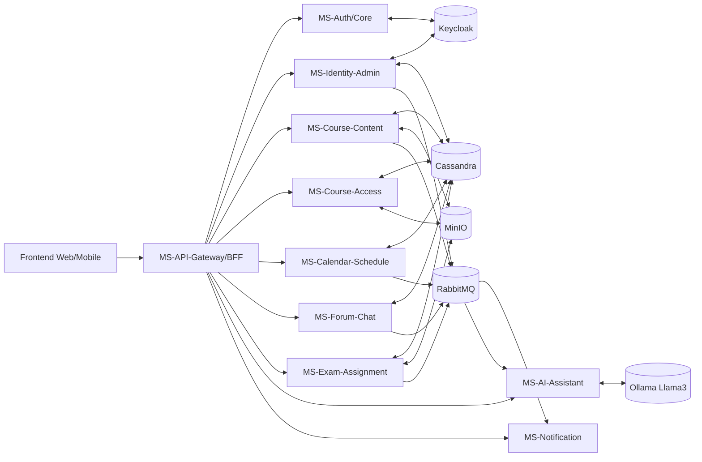
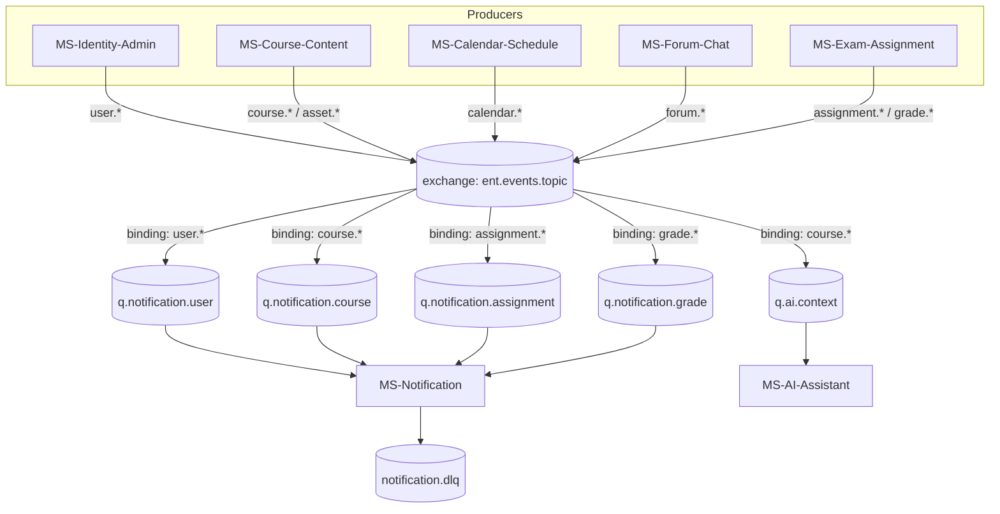
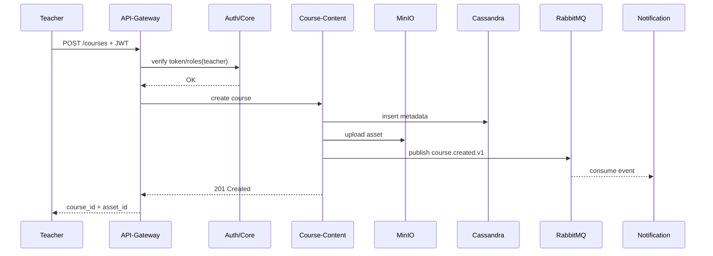
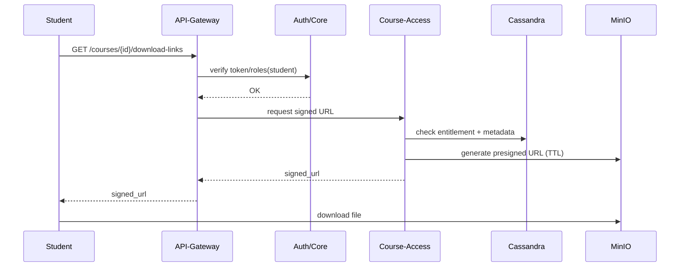

# ENT EST Salé — README Technique (Architecture Microservices)

## 1) Objectif du projet
Mettre en place un **ENT (Espace Numérique de Travail)** pour l’EST Salé, basé sur une architecture **microservices**, **sécurisée**, **scalable**, déployée en **cloud privé** (VMware ESXi + Ubuntu + Kubernetes), avec une couche IA locale via **Ollama (Llama 3 Instruct)**.

Le but est de permettre:
- Gestion des utilisateurs (étudiants, enseignants, admins)
- Publication et consultation de cours/fichiers
- Communication (notifications, chat/forum)
- Gestion académique (calendrier, examens/devoirs)
- Assistance IA conversationnelle/générative

---

## 2) Références du sujet (PDF)
- **1 - Projet 2025-2026.pdf**
- **2 - DAT.pdf**

Le DAT impose de documenter: contexte, architecture opérationnelle/fonctionnelle/applicative/technique, planning, risques, coûts.

---

## 3) Principes d’architecture

### 3.1 Principes clés
- **1 service = 1 responsabilité métier principale**
- Communication synchrone: **REST**
- Communication asynchrone: **RabbitMQ** (événements métier)
- Auth centralisée: **Keycloak (OAuth2/OIDC + JWT)**
- Données distribuées: **Cassandra** (métadonnées), **MinIO** (objets/fichiers)
- Observabilité native: logs, métriques, traces
- Déploiement conteneurisé: **Docker + Kubernetes**

### 3.2 Tech stack cible
- Backend microservices: **Python FastAPI**
- Frontend: React (ou Angular/Vue)
- IAM: Keycloak
- DB: Cassandra
- Object storage: MinIO
- Messaging: RabbitMQ
- AI runtime: Ollama (Llama 3 8B Instruct en phase initiale)

---

## 4) Cartographie des microservices à réaliser

> Priorité: d’abord les services « fondation », puis les services métier.

### A. Fondation (à faire en premier)
1. **MS-Auth/Core**
2. **MS-Identity-Admin (gestion utilisateurs/rôles)**
3. **MS-Course-Content (ajout cours + métadonnées + fichiers)**
4. **MS-Course-Access (listing/téléchargement)**
5. **MS-API-Gateway/BFF**
6. **MS-Notification**

### B. Métier étendu (phase 2)
7. **MS-Calendar-Schedule**
8. **MS-Forum-Chat**
9. **MS-Exam-Assignment**
10. **MS-AI-Assistant**

---

## 5) Détail microservice par microservice (rôle, entrées, sorties)

## 5.1 MS-Auth/Core
**Rôle**
- Authentification des utilisateurs via Keycloak
- Validation des JWT côté API
- Gestion des politiques d’accès (RBAC)

**Entrées**
- Login utilisateur (username/password ou SSO)
- Requêtes avec Bearer token

**Sorties**
- JWT access token + refresh token
- Réponses d’autorisation (`200`, `401`, `403`)

**Dépendances**
- Keycloak, API Gateway

**Endpoints minimaux (côté API interne)**
- `GET /auth/health`
- `POST /auth/introspect` (optionnel)
- `GET /auth/me`

---

## 5.2 MS-Identity-Admin
**Rôle**
- Création/activation/suspension des comptes
- Affectation des rôles (`student`, `teacher`, `admin`)
- Gestion du profil de base

**Entrées**
- Commandes admin: créer utilisateur, assigner rôle

**Sorties**
- User profile consolidé
- Événements: `user.created`, `user.role.assigned`

**Données**
- Référence utilisateur: Keycloak + table profil Cassandra

**Endpoints**
- `POST /admin/users`
- `PATCH /admin/users/{id}/roles`
- `GET /admin/users/{id}`
- `GET /admin/users`

---

## 5.3 MS-Course-Content (upload enseignant)
**Rôle**
- Création/modification/suppression de cours
- Upload de ressources pédagogiques
- Stockage métadonnées + objets

**Entrées**
- Enseignant authentifié
- Payload cours: titre, description, module, tags
- Fichiers (PDF, PPT, ZIP...)

**Sorties**
- `course_id`
- URLs internes d’objets MinIO
- Événements: `course.created`, `course.updated`, `asset.uploaded`

**Stockage**
- Cassandra: métadonnées cours
- MinIO: objets binaires

**Endpoints**
- `POST /courses`
- `PUT /courses/{course_id}`
- `POST /courses/{course_id}/assets`
- `DELETE /courses/{course_id}/assets/{asset_id}`

---

## 5.4 MS-Course-Access (listing/téléchargement étudiant)
**Rôle**
- Lister les cours accessibles
- Délivrer lien de téléchargement sécurisé (pré-signé)

**Entrées**
- Étudiant authentifié
- Filtres de recherche (module, enseignant, date)

**Sorties**
- Liste paginée de cours
- URL pré-signée MinIO (TTL court)
- Événement: `course.download.requested` (optionnel)

**Endpoints**
- `GET /courses`
- `GET /courses/{course_id}`
- `POST /courses/{course_id}/download-links`

---

## 5.5 MS-Notification
**Rôle**
- Envoi notifications email/push/in-app
- Consomme les événements métiers RabbitMQ

**Entrées**
- Événements: `user.created`, `course.created`, `exam.published`

**Sorties**
- Emails envoyés
- Notifications push stockées/dispatchées

**Endpoints**
- `POST /notifications/test`
- `GET /notifications/{user_id}`

---

## 5.6 MS-Calendar-Schedule
**Rôle**
- Emplois du temps, événements pédagogiques, deadlines

**Entrées**
- Création événement (cours, TP, exam)

**Sorties**
- Agenda utilisateur
- Événements: `calendar.event.created`, `deadline.reminder`

**Endpoints**
- `POST /calendar/events`
- `GET /calendar/events`
- `PATCH /calendar/events/{id}`

---

## 5.7 MS-Forum-Chat
**Rôle**
- Forum de discussion + chat temps réel (WebSocket)

**Entrées**
- Message forum/chat, création thread

**Sorties**
- Messages persistés
- Broadcast en temps réel

**Endpoints**
- `POST /forum/threads`
- `POST /forum/threads/{id}/messages`
- `GET /forum/threads`
- `WS /chat/ws`

---

## 5.8 MS-Exam-Assignment
**Rôle**
- Publication devoirs/examens
- Soumission étudiante
- Notation et feedback

**Entrées**
- Sujet/consignes/fichier
- Soumissions (texte + fichiers)

**Sorties**
- Statut rendu, note, feedback
- Événements: `assignment.submitted`, `grade.published`

**Endpoints**
- `POST /assignments`
- `POST /assignments/{id}/submissions`
- `POST /assignments/{id}/grades`
- `GET /assignments/{id}/results`

---

## 5.9 MS-AI-Assistant
**Rôle**
- Assistant ENT via Ollama/Llama 3
- Q&A sur cours et procédures ENT
- Génération résumés/FAQ

**Entrées**
- Prompt utilisateur + contexte (cours, profil, rôle)

**Sorties**
- Réponse IA textuelle
- (optionnel) références des documents utilisés

**Endpoints**
- `POST /ai/chat`
- `POST /ai/summarize`
- `POST /ai/faq/generate`

**Sécurité IA**
- Filtrage prompt (injection)
- Limites de tokens, rate limit
- Journalisation audit prompts/réponses

---

## 6) Flux bout-en-bout principaux

### Flux 1 — Création d’un cours (teacher)
1. Enseignant s’authentifie (MS-Auth)
2. Crée cours (MS-Course-Content)
3. Upload fichiers vers MinIO
4. Métadonnées écrites dans Cassandra
5. Événement `course.created`
6. MS-Notification notifie étudiants ciblés

### Flux 2 — Téléchargement cours (student)
1. Étudiant s’authentifie
2. Liste les cours (MS-Course-Access)
3. Demande lien pré-signé
4. Télécharge depuis MinIO
5. Log d’accès et métriques

### Flux 3 — Admin provisionne utilisateurs
1. Admin crée compte (MS-Identity-Admin)
2. Rôle assigné dans Keycloak
3. Profil synchronisé Cassandra
4. Événement `user.created`

### Flux 4 — Assistant IA
1. Utilisateur pose question
2. MS-AI vérifie auth + contexte
3. Interroge Ollama
4. Retourne réponse + traces d’audit

---

## 7) Contrat de données minimal (suggestion)

### 7.1 `Course`
- `course_id` (UUID)
- `title` (string)
- `description` (string)
- `teacher_id` (UUID)
- `module_code` (string)
- `created_at` (timestamp)
- `updated_at` (timestamp)
- `visibility` (`public_class`, `private_group`)

### 7.2 `Asset`
- `asset_id` (UUID)
- `course_id` (UUID)
- `filename` (string)
- `mime_type` (string)
- `size_bytes` (int)
- `minio_bucket` (string)
- `minio_object_key` (string)

### 7.3 `UserProfile`
- `user_id` (UUID)
- `role` (`student|teacher|admin`)
- `full_name` (string)
- `email` (string)
- `status` (`active|suspended`)

---

## 8) Ordre de réalisation (qui est premier)

## Sprint 0 — Fondations infra (bloquant)
- Repo mono/polyrepo défini
- Kubernetes namespace + ingress
- Keycloak prêt (realm, clients, rôles)
- Cassandra + MinIO opérationnels
- RabbitMQ opérationnel
- CI/CD minimal

## Sprint 1 — Vertical slice MVP
1. **MS-Auth/Core** (priorité absolue)
2. **MS-Identity-Admin**
3. **MS-Course-Content**
4. **MS-Course-Access**
5. **MS-API-Gateway**

> Fin Sprint 1: un enseignant publie un cours et un étudiant le télécharge.

## Sprint 2 — Collaboration
6. MS-Notification
7. MS-Calendar-Schedule
8. MS-Forum-Chat

## Sprint 3 — Évaluation + IA
9. MS-Exam-Assignment
10. MS-AI-Assistant

---

## 9) Plan de travail parallèle (équipe)

## Équipe A — Plateforme/DevOps
- K8s, Helm, ingress, secrets
- Observabilité (Prometheus/Grafana, logs)
- CI/CD GitHub Actions
- Environnements dev/stage

## Équipe B — IAM & Admin
- Keycloak realm/clients/roles
- MS-Auth/Core + MS-Identity-Admin
- Politique RBAC et tests sécurité

## Équipe C — Learning Content
- MS-Course-Content
- Cassandra schema cours/assets
- Intégration MinIO upload

## Équipe D — Access & UX API
- MS-Course-Access
- Génération URL pré-signées
- Pagination/recherche

## Équipe E — Collaboration
- Notification + calendrier + forum/chat

## Équipe F — Assessment & AI
- Exam/assignments
- AI assistant Ollama

**Règle critique pour paralléliser sans blocage:**
- Contrats API figés dès J+3 (OpenAPI)
- Événements RabbitMQ figés dès J+5
- Schémas de payload versionnés (`v1`, `v2`)

---

## 10) Normes de développement communes
- OpenAPI obligatoire pour chaque service
- Lint/format/type-check avant merge
- Tests unitaires + intégration + contrat
- Idempotence sur endpoints sensibles
- Timeouts/retry/circuit-breaker sur appels inter-services
- Correlation ID sur tous les logs

---

## 11) Sécurité
- Zero trust entre services
- JWT vérifié côté gateway + service
- RBAC strict (`student`, `teacher`, `admin`)
- Secrets via K8s Secrets/Vault
- Chiffrement TLS intra-plateforme
- Anti-abus: rate limit + quotas
- Audit trail (actions admin, téléchargements, IA)

---

## 12) Observabilité & SLO
- **SLO disponibilité**: 99.5% MVP
- **P95 latency** API critique < 400 ms (hors téléchargement fichier)
- Dashboards: auth success rate, upload success rate, download latency, AI response time
- Alerting: erreurs 5xx, saturation CPU/RAM, queue backlog RabbitMQ

---

## 13) Risques majeurs & mitigation
1. **Dépendance IAM (Keycloak) en retard**
   - Mitigation: mocks JWT + contrat stable
2. **Modélisation Cassandra incorrecte**
   - Mitigation: design by query + revues architecture
3. **Performance MinIO upload/download**
   - Mitigation: tests charge précoces
4. **Coût infra IA**
   - Mitigation: démarrer Llama 3 8B, quotas usage
5. **Couplage fort inter-services**
   - Mitigation: événements asynchrones + API versioning

---

## 14) Livrables attendus par microservice
Chaque équipe livre pour son service:
1. Code service FastAPI
2. `openapi.yaml`
3. Dockerfile
4. Helm chart (ou manifests K8s)
5. Tests + jeux de données
6. Dashboard métriques
7. Documentation d’exploitation

---

## 15) Structure repository recommandée (exemple)
```text
/devops-project
  /services
    /ms-auth-core
    /ms-identity-admin
    /ms-course-content
    /ms-course-access
    /ms-notification
    /ms-calendar-schedule
    /ms-forum-chat
    /ms-exam-assignment
    /ms-ai-assistant
  /platform
    /k8s
    /helm
    /keycloak
    /cassandra
    /minio
    /rabbitmq
    /observability
  /gateway
  /frontend
  /docs
    /adr
    /api-contracts
```

---

## 16) Définition de Done (DoD) — microservice
Un microservice est “Done” si:
- Endpoints implémentés et documentés
- Sécurité JWT/RBAC active
- Tests passants en CI
- Image Docker versionnée
- Déploiement K8s en environnement stage
- Logs/métriques/traces visibles
- Runbook incident disponible

---

## 17) Décision immédiate (à exécuter maintenant)
1. Valider ce README comme **contrat d’équipe**
2. Geler la liste MVP: Auth, Admin, Course-Content, Course-Access, Gateway
3. Créer 6 équipes parallèles (A→F)
4. Démarrer Sprint 0 (infra) + Sprint 1 (MVP)
5. Organiser revue d’architecture 2 fois/semaine

---

Ce document est la base de travail commune pour développer **en parallèle** les microservices sans bloquer les équipes.

---

## 18) Spécification détaillée des microservices (niveau implémentation)

## 18.1 MS-API-Gateway/BFF (obligatoire en frontal)
**Responsabilités**
- Point d’entrée unique frontend/mobile
- Vérification JWT primaire + propagation claims vers services
- Rate limiting, CORS, routing, versioning d’API

**Entrées**
- Requêtes HTTP du frontend

**Sorties**
- Routage vers microservices internes
- Réponses unifiées (format d’erreur standard)

**Règles techniques**
- Timeout upstream: 2–5s selon endpoint
- Retry seulement sur GET idempotents
- Correlation ID obligatoire (`X-Correlation-ID`)

---

## 18.2 MS-Auth/Core (contrat sécurité)
**RBAC minimal**
- `admin`: gestion utilisateurs, rôles, supervision
- `teacher`: création cours, publications, évaluations
- `student`: consultation, téléchargement, soumission

**Claims JWT attendus**
- `sub`, `preferred_username`, `email`, `realm_access.roles`, `exp`, `iat`

**Codes d’erreur standards**
- `401_UNAUTHENTICATED`
- `403_FORBIDDEN`
- `498_TOKEN_EXPIRED`

---

## 18.3 MS-Identity-Admin (gouvernance utilisateurs)
**Use-cases détaillés**
- Provisioning utilisateur en masse (CSV)
- Suspension/réactivation
- Audit des changements de rôle

**I/O type**
- Input: commande admin + rôle cible
- Output: statut provisioning + identifiants créés

**Événements publiés**
- `user.created.v1`
- `user.updated.v1`
- `user.suspended.v1`
- `user.role.assigned.v1`

---

## 18.4 MS-Course-Content (ownership contenu)
**Règles métier**
- Un cours appartient à un `teacher_id`
- Versionning optionnel du cours (`version_number`)
- Taille max fichier configurable (ex: 100 MB)

**Validation entrée**
- MIME whitelist (`application/pdf`, `application/vnd.ms-powerpoint`, `application/zip`)
- Antivirus scan async (si disponible)

**Événements publiés**
- `course.created.v1`
- `course.updated.v1`
- `course.deleted.v1`
- `asset.uploaded.v1`

---

## 18.5 MS-Course-Access (lecture sécurisée)
**Règles d’accès**
- Un étudiant voit uniquement les cours de sa filière/groupe
- Lien pré-signé MinIO TTL court (ex: 60–180 sec)

**Sorties techniques**
- Pagination: `page`, `size`, `total`
- Tri: `created_at`, `module_code`

**Événements publiés (optionnels analytics)**
- `course.viewed.v1`
- `course.download.requested.v1`

---

## 18.6 MS-Notification (canal omnicanal)
**Canaux**
- Email (SMTP)
- In-app
- Push (optionnel)

**Politique de retry**
- 3 tentatives avec backoff exponentiel
- Échec final vers DLQ (`notification.dlq`)

**Événements consommés**
- `user.created.v1`
- `course.created.v1`
- `assignment.published.v1`
- `grade.published.v1`

---

## 18.7 MS-Calendar-Schedule
**Règles métier**
- Conflit d’horaires détecté avant création
- Rappels automatiques (J-1, H-1)

**Événements publiés**
- `calendar.event.created.v1`
- `calendar.event.updated.v1`
- `deadline.reminder.v1`

---

## 18.8 MS-Forum-Chat
**Forum (persisté)**
- Threads, replies, modération

**Chat (temps réel)**
- WebSocket channel par classe/groupe
- Présence utilisateur + anti-spam

**Événements publiés**
- `forum.thread.created.v1`
- `forum.message.posted.v1`

---

## 18.9 MS-Exam-Assignment
**Règles métier**
- Date limite obligatoire
- Verrouillage après deadline (selon politique)
- Barème configurable

**Événements publiés**
- `assignment.published.v1`
- `assignment.submitted.v1`
- `grade.published.v1`

---

## 18.10 MS-AI-Assistant
**Modes**
- Chat contextuel ENT
- Résumé de document
- Génération FAQ

**Guardrails**
- Redaction PII dans logs
- Blocage prompts malveillants
- Budget tokens / utilisateur / jour

**Entrées contextuelles minimales**
- `user_id`, `role`, `question`, `context_refs[]`

---

## 19) Schéma global de communication entre microservices

## 19.1 Vue architecture (sync + async)


## 19.2 Schéma des événements RabbitMQ (topic design)


## 19.3 Matrice de communication inter-services
| Source | Type | Cible | Objet | Contrat |
|---|---|---|---|---|
| Frontend | HTTP | API-Gateway | Entrée unique | REST JSON |
| API-Gateway | HTTP | Auth/Core | Vérif token, `/me` | JWT/OIDC |
| API-Gateway | HTTP | Identity-Admin | CRUD users/roles | REST JSON |
| API-Gateway | HTTP | Course-Content | CRUD cours + upload | multipart + JSON |
| API-Gateway | HTTP | Course-Access | Listing + liens signés | REST JSON |
| API-Gateway | HTTP | Calendar | Événements planning | REST JSON |
| API-Gateway | HTTP/WS | Forum-Chat | Forum + temps réel | REST + WebSocket |
| API-Gateway | HTTP | Exam-Assignment | Devoirs/soumissions/notes | REST JSON |
| API-Gateway | HTTP | AI-Assistant | Chat/summarize/faq | REST JSON |
| Identity-Admin | Event | Notification | `user.*` | RabbitMQ topic |
| Course-Content | Event | Notification | `course.*`, `asset.*` | RabbitMQ topic |
| Exam-Assignment | Event | Notification | `assignment.*`, `grade.*` | RabbitMQ topic |
| Course-Content | Event | AI-Assistant | Nouveau contenu contextuel | RabbitMQ topic |

## 19.4 Modèle standard d’événement
Tous les événements doivent suivre ce contrat:
```json
{
   "event_id": "uuid",
   "event_type": "course.created.v1",
   "occurred_at": "2026-04-11T10:15:00Z",
   "producer": "ms-course-content",
   "correlation_id": "uuid",
   "payload": {}
}
```

---

## 20) Séquences critiques (schemas opérationnels)

## 20.1 Séquence upload enseignant


## 20.2 Séquence téléchargement étudiant


---

## 21) Découpage parallèle “sans collision” (ownership strict)
- **Équipe IAM** possède: Auth/Core + Identity-Admin + modèle RBAC
- **Équipe Learning** possède: Course-Content + Course-Access + schéma `Course/Asset`
- **Équipe Collaboration** possède: Notification + Calendar + Forum-Chat
- **Équipe Assessment** possède: Exam-Assignment
- **Équipe AI** possède: AI-Assistant + intégration Ollama
- **Équipe Platform** possède: Gateway, RabbitMQ, Cassandra, MinIO, K8s, CI/CD

**Règle d’intégration**
- Interdiction d’appeler directement la DB d’un autre service
- Échanges inter-domaines via API publique ou événement RabbitMQ
- Chaque équipe publie son `openapi.yaml` + `events.md`
